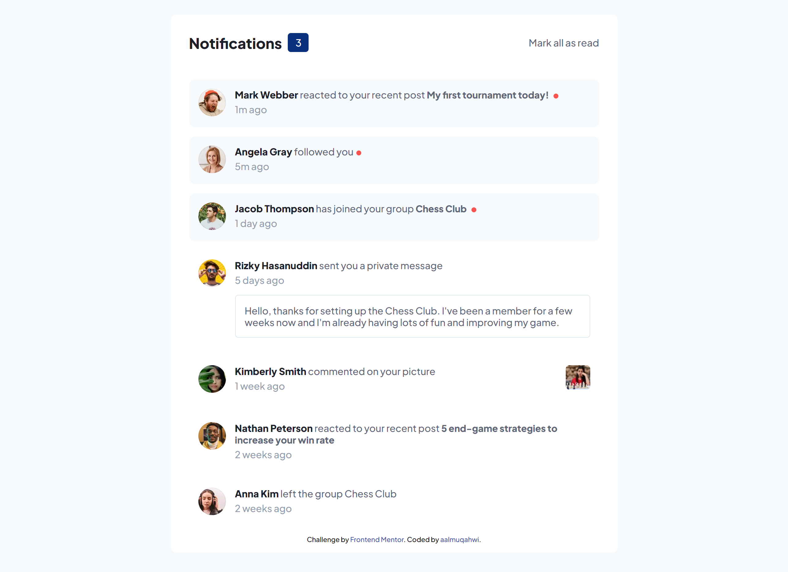
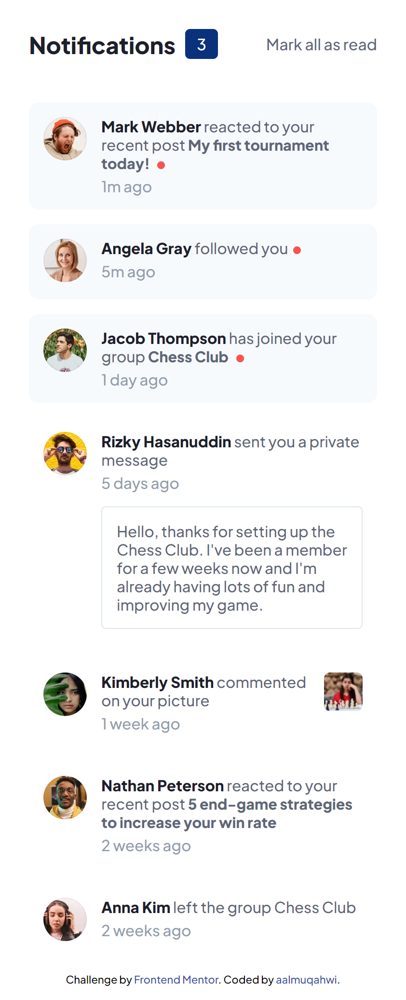

# Frontend Mentor - Notifications page solution

This is a solution to the [Notifications page challenge on Frontend Mentor](https://www.frontendmentor.io/challenges/notifications-page-DqK5QAmKbC). Frontend Mentor challenges help you improve your coding skills by building realistic projects.

## Table of contents

- [Overview](#overview)
  - [The challenge](#the-challenge)
  - [Screenshot](#screenshot)
- [My process](#my-process)
  - [Built with](#built-with)
  - [What I learned](#what-i-learned)
  - [Continued development](#continued-development)
- [Author](#author)

## Overview

### The challenge

Users should be able to:

- Distinguish between "unread" and "read" notifications
- Select "Mark all as read" to toggle the visual state of the unread notifications and set the number of unread messages to zero
- View the optimal layout for the interface depending on their device's screen size
- See hover and focus states for all interactive elements on the page

### Screenshot

Desktop



Mobile



## My process

### Built with

- Sass
- Flexbox
- Mobile-first workflow
- Gulp

### What I learned

- How to use Gulp to create tasks to compile Sass to css.
- How to split the SASS file into small files and load them where needed.

```css
@use "colors";
@use "base";
```

### Continued development

I will continue learning CSS responsive design alongside SASS.

## Author

- Frontend Mentor - [@aalmuqahwi](https://www.frontendmentor.io/profile/aalmuqahwi)
